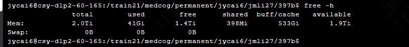
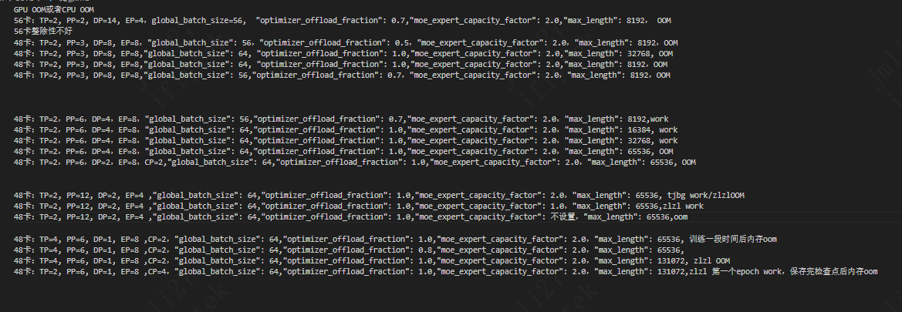

# 全参 397B 显存：params+grads≈1.6TB 上卡，优化器状态≈4.76TB 需 offload 到 CPU。

 CPU offload 量 = 4.76TB / 节点数：48卡(6节点)≈793GB/节点（易 CPU 内存-OOM），
 - global batch size=64，48卡
 - TP=2，PP=6，DP=4,EP=8，moe_expert_capacity_factor 2.0 32kwork，64kOOM

|offload_fraction |	GPU 上的优化器 |	实际训练内存CPU/节点占用| max_lenth | GPU峰值|
|---|---|---|---|---|
|0.7(当前)	|0.3×99G/卡 ≈ 30GB/卡|~1.14TB|8k|107GB|
|1.0	|0(全 offload)|	~1.61TB|16k|92GB|
|1.0 |0（全offload）|1.62TB|32k|133GB|

64k
- TP=2，PP=12，DP=2,EP=4，moe_expert_capacity_factor 2.0，体检报告work，zlzl oom
- TP=2，PP=12，DP=2,EP=4，moe_expert_capacity_factor null，zlzl oom
- TP=2，PP=12，DP=2,EP=4，moe_expert_capacity_factor 1.0，zlzl work

|offload_fraction |	GPU 上的优化器 |	实际训练内存CPU/节点占用| max_lenth | GPU峰值|moe_expert_capacity_factor|
|---|---|---|---|---|---|
|1.0 |0(全offload)|1.59TB|64k|135G|1.0|
|1.0 |0(全offload)|1.58TB|64k|139G|2.0|
> 节点内存 2TB / 可用 ~1.9TB，**host 不是瓶颈，offload 1.0 随便用**。

---

## 实验结论：PP 是决定性杠杆（激活瓶颈）

实测：48卡 **PP=3 / 56卡 PP=2 各种调（offload 0.5~1.0、max_len 8k）全部 OOM**，
唯独 **PP=6 work**。原因：本任务是**激活显存瓶颈**，激活 ∝ 每卡层数 = 60/PP。
→ 要省显存/上长序列，**优先加 PP**（不是加 EP、不是降 offload）。
激活显存 ∝ micro_batch_size × 序列长度(max length) × 每卡层数

### 48 卡 PP 阶梯（TP=2，PP×DP=24，PP 整除 24 与 60，EP 整除 TP×DP）

| PP | DP | EP | 每卡层数(60/PP) | 备注 |
|---|---|---|---|---|
| 3 | 8 | 8 | 20 | 已验证 OOM |
| 6 | 4 | 8 | 10 | 当前 work（8k 验证过） |
| 12 | 2 | 4 | 5 | 下一档，激活再砍半 |

注：`PP=12,EP=4` 的每卡专家参数与 `PP=6,EP=8` **相同**（PP翻倍砍半层数，抵消EP砍半），
而激活与非专家参数再减半 → 严格更省显存，代价仅 DP=2（流水线气泡略增 ~34%）。

---

## 32k→64k 与重计算到顶

- **batch 不影响显存峰值**：mbs=1 已到底；global_batch 只改梯度累积次数（micro-batch 串行跑、梯度原地累加、激活逐个释放），**不堆显存**，所以调它对峰值无效，每个 micro-batch 的梯度原地累加进同一个固定大小的梯度 buffer，累积只是把更多 micro-batch 串行跑、梯度往同一个 buffer 里加,不堆显存。梯度 buffer 本身(全量梯度)是一直占着的(它在 grad_norm 那步就在显存里),但这是"梯度"的固有开销,不是"累积"带来的额外开销——累积 1 次和 100 次,这个 buffer 一样大。
- **重计算已到顶**：当前 `--recompute_granularity full` 已重算全部层（含 MoE 层），是最高档。
  - ⚠️ 此时**别加 `--moe_layer_recompute true`**：会报
    `ValueError: Do not set --moe-layer-recompute with full recompute granularity`（且该参数已废弃）。
    moe_layer_recompute 只用于「没开 full」时选择性重算 MoE 层，和 full 冲突。
- **所以 64k 只剩两条结构性杠杆**：
  - `PP=12`(TP=2,PP=12,DP=2,EP=4)：每卡 5 层，激活减半，等效回到 32k@PP6（已验证可跑）；
  - `CP=2`(切序列维)：长上下文正规解法，但 Qwen3.5 GDN 的 CP 需 mcore-bridge>=1.1.0 + megatron-core main。
- **64k 的 OOM 与数据有关**：packing 填充率 + 单条样本长度（影响 full-attention 层）+ MoE 路由都随数据变，
  临界配置下「换数据集不爆」不代表稳，必须靠 PP=12/CP 留出结构性余量。
- **PP 救不了 64k 的全部**：PP 只砍"每层块激活"，但 **router/aux-loss、MoE dispatch、首末段 embedding/LM-head
  等"序列长度线性"的内存 PP 动不了**。实测 PP=12 时 64k 仍 OOM，且 OOM 跳到 MoE router 的 all_reduce
  （`_apply_aux_loss → reduce_from_tensor_model_parallel_region`），正是序列线性内存。**只有 CP（切序列维）能减这部分。**

---

## moe_expert_capacity_factor 的显存与质量（64k 实测）

实测（64k, PP=12, offload=1.0）：
| capacity_factor | 行为 | GPU峰值 | 结果 |
|---|---|---|---|
| null(dropless) | 不丢、不封顶 | — | OOM（有专家收到远超均值的 token） |
| 2.0 | 封顶 2×均值 | 139G | OOM（贴 140 上限） |
| 1.0 | 封顶 1×均值 | 135G | work |

**结论（关键，含一处易错点）：**
- dropless 和 2.0 都 OOM、仅 1.0 work ⇒ **64k 这份数据路由确实不均**，有专家收到 >1× 均值的 token。
- **`moe_pad_expert_input_to_capacity=False`（默认）下**：专家 buffer 按**实际处理的 token 数**分配，
  **不会预留 padding 到容量上限**。所以：
  - capacity=2 比 1.0 多占的 ~4G，是**真的多算了 `[1×,2×]` 区间的 token**，**不是浪费的预留**；
  - 降到 1.0 = 把这批 token **丢弃** → 省显存，代价是它们没经过专家（**质量↔显存的真实权衡**）。
  - ⚠️ 只有 `pad_to_capacity=True` 时，才会"按上限预留、没填满=白占显存"。我们是 False，无此浪费。
- **质量影响**：capacity=1.0 丢 token 更多，但本例 1.0↔2.0 仅差 4G ⇒ 不均程度有限 ⇒ 丢得不多 ⇒ 质量影响大概率有限但非零。
- **取舍**：64k 逼到 capacity=1.0（丢 token）+ 零余量；而 **32k@capacity=2 不丢 token、稳**。
  长度 vs 稳定+不丢 token，按任务权衡——医疗 SFT 多数 32k 足够。

## 新环境 swift_sft_397b 支持TP>2,开CP
### 训练多模态
TP=2，PP=6，DP=4,EP=8，moe_expert_capacity_factor 2.0 32kwork，冻结vit和aligner：内存占用1.80T，显存112G/144G
TP=2，PP=12，DP=1,EP=4，CP=2，moe_expert_capacity_factor 2.0 64kwork，冻结vit和aligner：内存占用1.87T，显存102G/144G

### 训练文本（zlzl）
TP=4，PP=6，DP=1，EP=8，CP=2，moe_expert_capacity_factor 2.0 ，optimizer_offload_fraction 1.0，支持64k上下文，内存占用1.75T/1.9T，显存占用80G/140G，训练一段时间会内存oom
TP=4，PP=6，DP=1，EP=8，CP=2，moe_expert_capacity_factor 2.0 ，optimizer_offload_fraction 0.8，64k zlzl work，内存占用1.41T/1.9T，显存占用97G/140G
TP=4，PP=6，DP=1，EP=8，CP=2，moe_expert_capacity_factor 2.0  128k zlzl oom
TP=2，PP=6，DP=1，EP=8，CP=4，moe_expert_capacity_factor 2.0  128k zlzl work，内存占用1.75T，显存137G，但是训练第2个epoch内存达到1.96T，然后一直卡着

内存占用必须在1.6T左右，显存130G左右，可以正常训练完